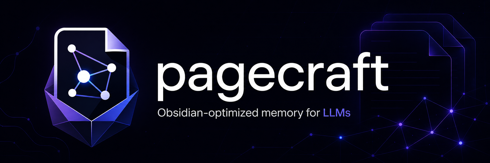

<p align="center">
  
</p>

# Pagecraft

Pagecraft turns a local Markdown vault into active memory for LLM agents.

It gives Codex, Claude Code, and other agents a simple way to find project context, update durable knowledge, ingest raw notes, and avoid duplicating pages.

## Why Pagecraft Exists

LLM agents are useful when they remember the right project facts, but most Markdown vaults are too expensive to read blindly.

Pagecraft adds a small operating contract:

- `wiki/hot.md` is the short active-memory cache agents read first.
- `wiki/index.md` is the canonical retrieval map.
- `wiki/log.md` records every persistent mutation.
- `rawinput/` is staging for new notes and sources.
- `raw/` is immutable after ingest.
- `CLAUDE.md` stays the canonical write-time contract.

The goal is simple: make the wiki cheap enough that agents use it by default.

## 60-Second Start

Clone the repo:

```bash
git clone https://github.com/panamini/Pagecraft.git
cd Pagecraft
```

Initialize a new vault:

```bash
python3 scripts/init_vault.py /path/to/my-vault
```

Initialize a test vault with a sample note:

```bash
python3 scripts/init_vault.py /tmp/pagecraft-vault --with-sample
```

Then ask your agent:

```text
Use this vault as memory. Start from llms.txt, then read wiki/hot.md before opening broader wiki pages.
```

## What Agents Should Read

| Agent | First file | Why |
| --- | --- | --- |
| Generic LLM agent | `llms.txt` | Compact discovery map. |
| Codex or AGENTS-aware tool | `AGENTS.md` | Compatibility shim. |
| Claude Code | `CLAUDE.md` | Canonical write-time rules. |

For project context, the retrieval order is:

```text
wiki/hot.md -> wiki/index.md -> relevant canonical pages
```

Agents should not scan the whole vault unless the task needs a deep audit.

## Vault Shape

```text
vault/
├── llms.txt
├── WIKI_SCHEMA.md
├── CLAUDE.md
├── AGENTS.md
├── rawinput/
├── raw/
└── wiki/
    ├── hot.md
    ├── index.md
    ├── log.md
    ├── overview.md
    ├── product/
    ├── tech/
    ├── design/
    ├── sources/
    ├── outputs/
    └── archive/
```

## Core Workflows

### Use the wiki as memory

```text
Use this vault as memory. Start from llms.txt and answer using the smallest relevant read set.
```

### Ingest a note

Drop a file into `rawinput/`, then ask:

```text
Use the ingest-wiki skill. Ingest the files in rawinput.
```

The agent should create or reuse source pages, update durable pages, move the raw file into `raw/`, and update `wiki/index.md`, `wiki/log.md`, and `wiki/hot.md`.

### Save an analysis

```text
Save this output into the wiki.
```

The agent should write to `wiki/outputs/` and update the control-plane files.

## Design Rules

- One active durable page per subject.
- Update before creating.
- Dedupe before writing.
- Archive or supersede instead of leaving competing truths.
- Keep `wiki/hot.md` under 500 words.
- Never treat `wiki/hot.md` as canonical truth.

## Package Files

- `llms.txt` - generic agent entrypoint
- `AGENTS.md` - Codex-compatible shim
- `CLAUDE.md` - canonical write-time contract
- `WIKI_SCHEMA.md` - neutral discovery schema
- `skills/ingest-wiki/SKILL.md` - ingest, update, lint, and save-output workflow
- `scripts/init_vault.py` - vault initializer
- `scripts/validate_hybrid.py` - package validation

## Visual Assets

The renamed assets are stored in `docs/assets/`.

| File | Use |
| --- | --- |
| `pagecraft-agent-memory-github-banner.png` | Recommended README hero. |
| `pagecraft-obsidian-llm-memory-hero.png` | Alternative hero or social preview. |
| `pagecraft-logo-transparent-wide.png` | Compact logo/header asset. |

## Status

Pagecraft is intentionally small. It is not an Obsidian plugin, vector database, MCP server, or auto-commit system.

It is a portable contract for agent-readable Markdown memory.
